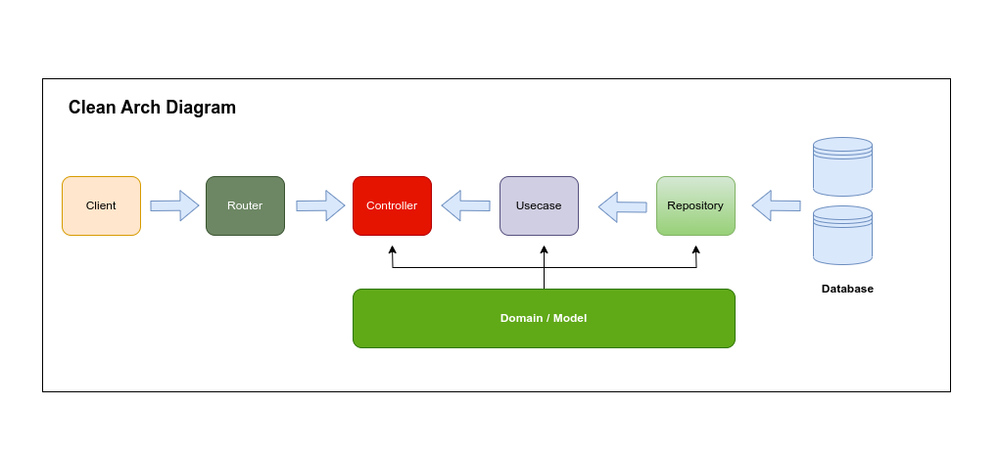

# oncar-job-challenge

Mono repo para desenvolvimento do projeto **oncar-job-challenge**

### Desenvolvido por

Nome: **Leonardo Simões**
<br />
Contato: **leolbsti@gmail.com**

### Arquitetura

Uma possível solução para o problema descrito nesse desafio é a utilização da "**Clean Architecture**" onde temos
as principais camadas conforme imagem a seguir:

<br />



<br />
<br />

**Router** - Camada que intercepta diretamente as requisições do clientes web. Neste desafio, considere que o request do usuário
proveniente do frontend tem credenciais de acesso válidas e verificadas.

**Controller** - Após a rota ter interceptado o request, ela direciona o mesmo para o controller de modo que o mesmo valide
os dados enviados atráves do payload e faz as devidas validações retornando erro quando for o caso. Se tudo estiver correto
no request a camada de usecase irá realizar a operação solicitada.

**Usecase** - Camada que implementa a lógica de negócio. Essa camada utiliza a camada de repository para efetuar as operações
que incluem o banco de dados(storage).

**Repository** - Camada que tem uma abstração da interface de banco de dados, ela é totalmente independente da implementação utilizada
e pode ser facilmente trocada por outra implementação de banco de dados.

**Domain** - Camada que inclui:

- **Models**: objetos/estruturas utilizados no request e response. Muitas vezes podems ser chamados de DTO(Data transfer object).
- **Entities**: objetos/estruturas utilizados nas operações diretas com o banco de dados.
- **Interfaces**: utilizadas pelas camadas de usecases e repositories.

## Design do projeto

A estrutura está organizada conforme esquema abaixo:

```bash
├── api (1)
│   ├── route (1.1)
├── ├── controller (1.2)
│   │  
├── config (2)
├── db (3)
│   ├── migrations (3.1)
├── docs (4)
│   ├── images (4.1)
├── domain (5)
│   ├── mocks (5.1)
├── pkg (6)
│   ├── input (6.1)
├── ├── validator (6.2)
│   │ 
├── postgres (7)
│   ├── data (7.1)
├── repository (8)
├── scripts (9)
├── usecase (10)
├── web (11)
│   ├── public
│       ├── css (11.1)
│       ├── js (11.2)
│       ├── views (11.3)
├── .env (12)
├── .env.example (13)
├── .gitignore (14)
├── docker-compose.yml (15)
├── go.mod
├── go.sum
├── main.go
└──  README.md
```

### (1) api

Contém os pacotes que definem as rotas e as implementações dos controllers.

- (1.1) **route**: pacote de arquivos que definem as rotas da API.
- (1.2) **controller**: implementações dos controladores chamados pelas rotas de cada entrypoint.

### (2) config

Contém os arquivos de configuração da aplicação.

### (3) db

Contém a implementação programática das migrations. Nesse projeto foi utilizado o goose.
Mais informações em: https://github.com/pressly/goose

- (3.1) **migrations**: arquivos extensão `.sql` a serem executados durante a inicialização da app.

### (4) docs

Contém os arquivos de documentação da aplicação.

- (4.1) **images**: arquivos formato imagem utilizados para criar a documentação do projeto. Ex: `oncararch.png`

### (5) domain

Contém os arquivos que definem os modelos de domínio.

- (5.1) **mocks**: arquivos mocks de implementação das interfaces utilizadas na execução de testes.

### (6) pkg

`Libs` que podem ser disponibilizadas publicamente para utilização por outras aplicações.

- (6.1) **input**: utilitário para formatar campos do tipo telefone e moeda.
- (6.2) **validator**: utilitário para validar campos do tipo telefone e params de entrada.

### (7) postgres

Contém diretório e arquivos utlizados pelo docker para salvar localmente todos os arquivos da estrutura do banco de dados.

- (7.1) **docker**: essa pasta é um `volume` local para que os dados e configs sejam mantidas localmente após você parar o `docker`.

### (8) repository

Contém os arquivos de implementação das interfaces de repositório.

### (9) scripts

Arquivos de configuração de ambiente. Aqui contém o arquivo de carga inicial de veículos `load-vehicles.sql`
O outro arquivo `initdb.sh` é utilizado pelo docker durante a inicialização. Não altere os arquivos.

### (10) usecase

Arquivos que implementam as interfaces de usecase relacionadas a lógica de negócio.

### (11) web

Contém os arquivos estáticos servidos pelo servidor. Representam o frontend app view dessa app.

- (11.1) **css**: todos os arquivos de estilização das páginas html.
- (11.2) **js**: todos os arquivos javascript.
- (11.3) **views**: todos os arquivos html.

### (12) .env

Arquivo de configuração de variáveis de ambiente. <br />
`ATENÇÃO ESSE ARQUIVO NÃO ESTÁ NO git. CRIE O SEU LOCALMENTE NA RAIZ DO PROJETO`

### (13) .env.example

Arquivo de configuração de variáveis de ambiente de exemplo. Faça uma cópia desse arquivo e renomeie para `.env`
<br />
Altere os valores conforme a sua definição de senhas e params. Sugestão: altere somente os valores entre `<>`

### (14) .gitignore

Arquivos e diretórios ignorados pelo git

### (15) docker-compose.yml

Arquivo de configuração do docker-compose. Manifest que define a infraestrutura utilizada nessa aplicação.
<br />
No nosso caso, vamos utilizar apenas o banco de dados `postgres versão 15`

## Executando a aplicação localmente

### Pré-requisitos

Você precisa ter instalado:

- **go** `versão 1.19+` &nbsp;&nbsp;&nbsp;Veja como instalar em: https://go.dev/doc/install
- **docker** e o **docker-compose** &nbsp;&nbsp;&nbsp;Veja como instalar em: https://docs.docker.com/compose/install
- **postgres-client v.15** &nbsp;&nbsp;&nbsp;Caso você não tenha instalado ainda segue a dica em: https://dbeaver.io/download/

### Passos para execução:

1. Clone este repositório:

```bash
git clone git@github.com:leosimoesp/oncar-job-challenge.git
```

2. Entre na pasta do projeto:

```bash
cd oncar-job-challenge
```

3. Criar o arquivo `.env` com base no arquivo de exemplo `.env.example`:

```bash
cp .env.example .env
```

4. Editar o arquivo `.env` e inserir as informações do seu banco de dados:

5. Executar os testes

```bash
go test -v ./...
```

Obs: Ocorreu o erro `pattern ./...: open /meu dir/git/oncar-job-challenge/postgres/data: permission denied`
Esse erro ocorre porque o docker altera a permissão do diretório. Você pode resolver isso de duas maneiras:

`Solução 1`: alterar a permissão da pasta postgres (volume local) utilizado pelo docker-compose com o comando

```bash
sudo chmod -R 775 postgres
```

`Solução 2`: mover a pasta postgres para outro local e criar um link simbólico na raiz do projeto com o nome de postgres

6. Inicializar o banco de dados

Ainda na raiz do projeto execute:

```bash
docker-compose up -d
```

7. Executar a aplicação. <br />
   Após a inicialização do banco de dados via docker-compose, execute na raiz do projeto

```bash
go run main.go
```

Você verá um log no console da aplicação rodando na porta 8080 ou a porta definida por você no arquivo `.env`

8. Carregar os dados iniciais de veículos. (`Deve ser carregado somente a primeira vez`). <br />
   A tabela de veículos está vazia, assim como a de leads. Utilizando um client para o banco de dados postgres, <br />
   execute o script `load-vehicles.sql` que está na pasta scripts. <br />
   Você pode copiar o contéudo do arquivo e colar na interface gráfica do client. Depois é só executar. <br />
   Esse passo não precisar ser executado novamente após reinicilizar a aplicação.

### Dúvidas

Em caso de erros ou dúvidas, deixo meu contato acima.
Obrigado.
